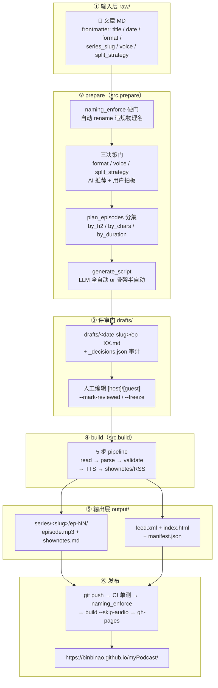
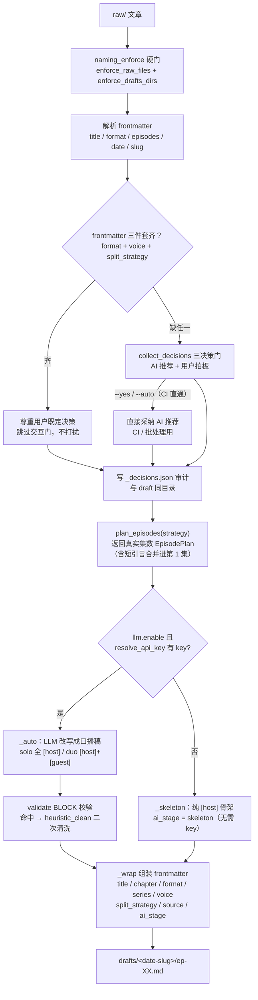
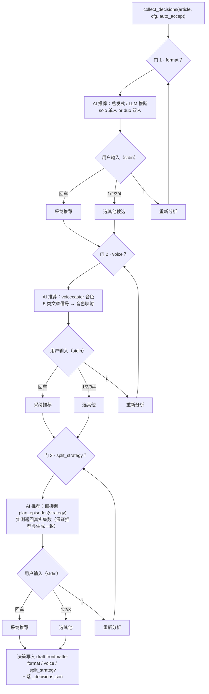
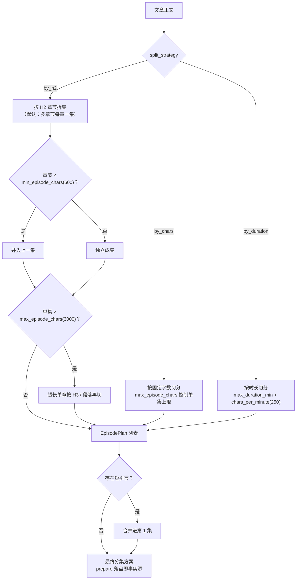
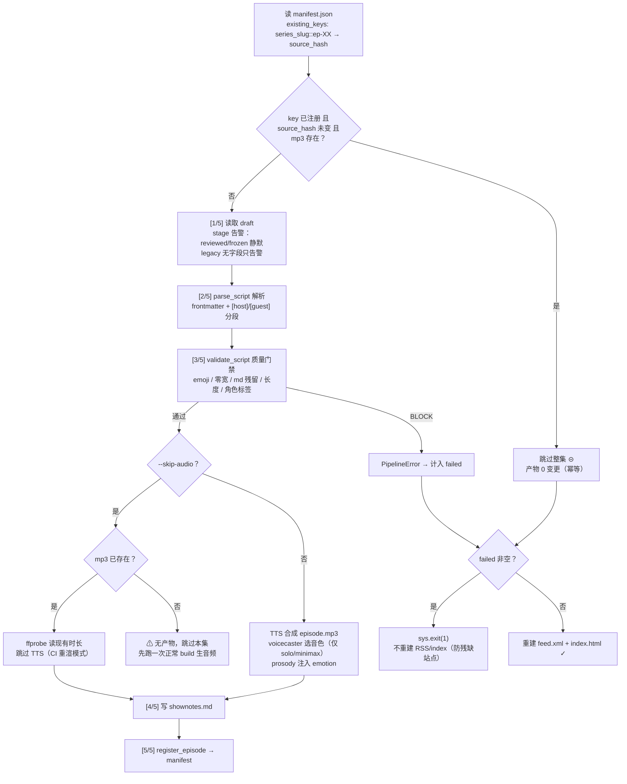
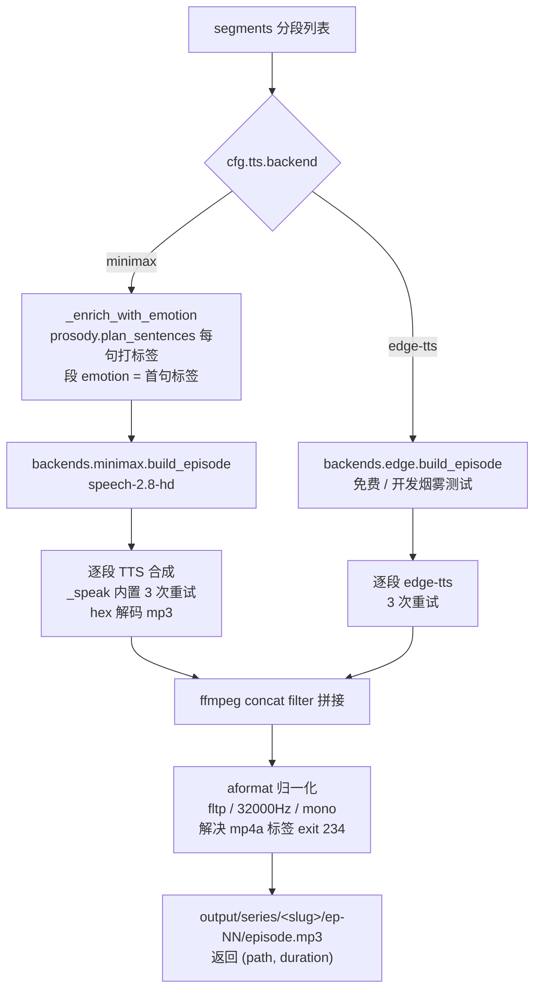
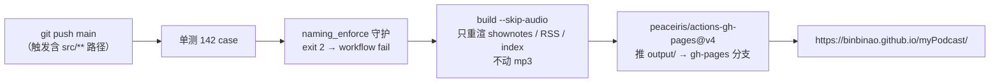
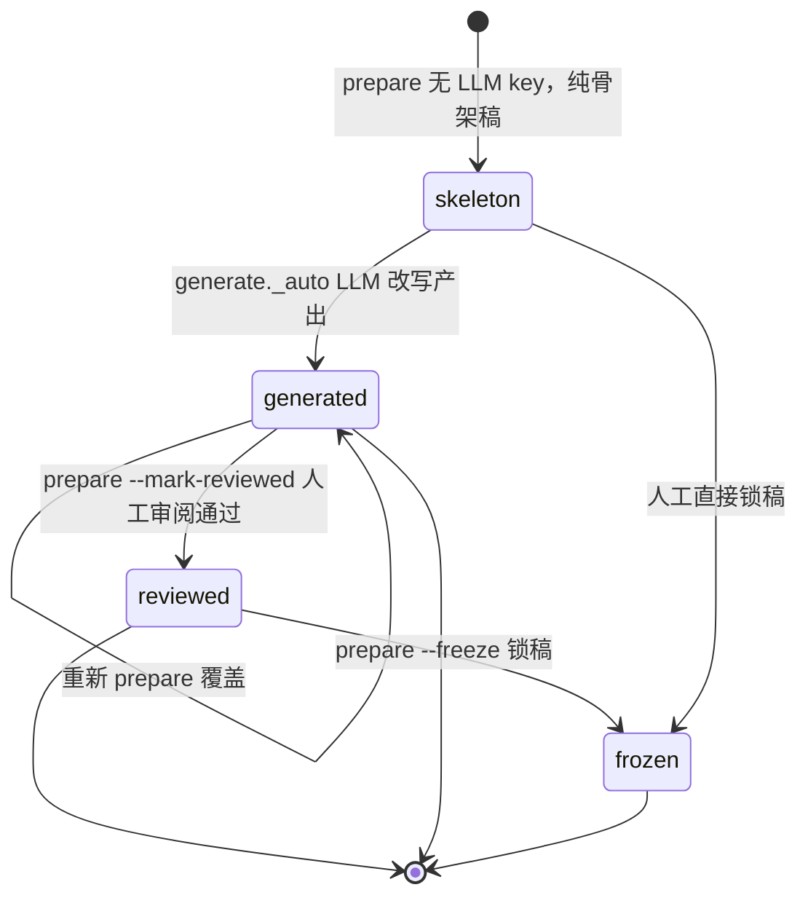

# myPodcast 全流程 Mermaid 图集（2026-08-02 review）

> 从一篇 markdown 文章到可订阅的播客站，完整流水线。
> 全部 8 张 mermaid 图已用 mermaid-cli 11.15 实测渲染通过，语法零错误。
> 代码与 README 交叉核对，反映当前真实行为（含三决策门、draft 只读契约、断点续传）。

## 渲染环境

| 查看器 | mermaid 支持 |
|---|---|
| GitHub / GitHub Issues | ✅ 原生渲染 |
| Obsidian | ✅ 原生渲染 |
| Typora | ✅ 原生渲染 |
| VS Code | 需装扩展：Markdown Preview Mermaid Support（或 md-mermaid） |
| mermaid.live | ✅ 粘贴代码即渲染（改图首选） |
| 纯文本查看器 | ❌ 显示为代码块，属正常 |

---

## 图 1 · 全景总览（End-to-End）

**要点**
- 三层数据层：`raw/`（源文章）→ `drafts/`（评审门）→ `output/`（最终产物，入库 git 跟踪）。
- `prepare` 只产出脚本不进音频；`build` 是通往 `output/` 的唯一路径。
- `build` 对 draft **只读**——正文逐字节来自 draft，不再二次 LLM 改写。

---

## 图 2 · prepare 内部流程

**要点**
- **三决策门原则**：AI 先给推荐 + 理由，用户永远有最终决定权；`--yes`/`--auto` 全自动采纳（默认交互）。
- frontmatter 三件套（`format`/`voice`/`split_strategy`）齐全时尊重用户，不重复打扰。
- `voice` 与 `split_strategy` 会写进 draft frontmatter，build 重渲时按 draft 脏值复现——**commit 前必须人工 review draft frontmatter**。

---

## 图 3 · 三决策门交互详图（src/decisions.py）

**要点**
- 每门都是「AI 推荐 → 用户拍板」，`r` 可重新分析，全程不猜用户。
- `recommend_split` 与最终生成走同一 `plan_episodes`，杜绝「推荐 3 集实际生成 5 集」的偏差。

---

## 图 4 · 分集策略决策树（src/split.py）

**要点**
- 分集原则：多章节每章一集、不按字数合并；仅单块长文按 `max_episode_chars` 切，超长单章再按 H3/段落细分。
- 关键坑：`split._strip_md` 必须剔除水平线 `---`（raw 用它分节但残留成段落，edge-tts 对纯 `---` 返回 `No audio was received`）。

---

## 图 5 · build 5 步 pipeline + 断点续传（src/build.py）

**要点**
- 断点续传：`source_hash = sha256(source)[:16]` 未变即跳过；`--only ep-XX` / `--from` / `--retry-failed` / `--force` 控制粒度。
- **`--skip-audio` 在 manifest 已注册集上幂等跳过整个 ep**——真正验证要用 `--only ep-XX --force`（真 TTS）或 `--skip-audio --force`（重渲）。
- 验证信号：**git status 有变化才算真通过**，不能凭「build 没报错」。

---

## 图 6 · TTS 内部（后端路由 + 音频拼接）

**要点**
- 后端切换**只改 config**（`tts.backend`），业务代码零改动（`@register` 抽象）。
- MiniMax 的 mp3 响应 mime 标签是 `mp4a`（实际编码 mp3），与 silence 拼接时 ffmpeg 会 exit 234——concat filter 前加 `aformat` 归一化解决。
- 韵律：heuristic（零依赖，按标点）输出 emotion 给 minimax 用；edge-tts 只吃 rate/pitch。

---

## 图 7 · 发布部署（CI + gh-pages）

**要点**
- 改 `src/**` 会触发 CI 重跑——改 `src/build.py` 等必须本地测通再 push。
- mp3 是付费 TTS 交付物，随仓库走；CI 永远 skip-audio。

---

## 图 8 · draft 生命周期状态机（ai_stage）

**要点**
- `set_stage` 只改 frontmatter 的 `ai_stage` 一行，正文逐字节保留。
- build 按 stage 告警：`reviewed`/`frozen` 静默；`skeleton`/`generated` 提示先审再 build。

---

## 数据层与契约速查

| 层 | 物理路径 | 字段来源 | 角色 |
|---|---|---|---|
| raw/ | `raw/YYYY-MM-DD-slug.md` | frontmatter `series_slug` → `slug` → ascii(title) | 源文章 |
| drafts/ | `drafts/<date-slug>/ep-XX.md` | 同上 | 评审门（可改 [host]/[guest]） |
| output/ | `output/series/<slug>/ep-NN/episode.mp3 + shownotes.md` | `series_slug` 字段 | 最终产物 |

**硬契约清单**
1. 新增 raw 后必须先跑 `scripts/normalize_raw_filenames.py` 验证三层物理名一致。
2. **build 永不调 polish()**——由 `tests/test_stages.py::TestBuildReadOnlyContract` AST 扫描机械 enforce。
3. API Key 不写 config/code/git，`resolve_api_key`：cfg → env `LLM_API_KEY`/`MINIMAX_API_KEY`/`OPENAI_API_KEY`。
4. MiniMax chat 必须发 `reasoning_split: true` + `thinking: {type: "disabled"}`，否则 tokens 全烧 reasoning。
5. commit 前必跑 `python -m src.build drafts/<某系列> --skip-audio --force` 必须绿。

---

## mermaid 语法注意事项（已实测）

- edge label 文本**不要以 `--` 开头**（会被 mermaid 解析成边语法报错），用管道形式显式界定：
  `A -->|"--yes / --auto"| B` ✅ / `A -- --yes --> B` ❌
- 节点文本里 `<` `>` 用 HTML 实体 `&lt;` `&gt;`；换行用 ` `。
- 菱形条件节点用 `{"...？"}`，引号内可用中文与标点。
- 状态机用 `stateDiagram-v2`（图 8），不是旧 `stateDiagram`。
- 修改图后验证：粘贴到 mermaid.live，或本地 `npx -y @mermaid-js/mermaid-cli -i fig.mmd -o /tmp/out.svg`。
