# myPodcast 高层流程图（写稿 → Review → 转 MP3）

> 一页式高层视角，只看三件事：怎么产出脚本、怎么人工 review、怎么合成 MP3。

## 三层数据流 + 三阶段动作

```mermaid
flowchart LR
    subgraph S1["① 写稿（src.prepare）"]
        direction LR
        R["📄 raw/&lt;date-slug&gt;.md<br/>MD 正文 + frontmatter"] -->|split +<br/>LLM generate| D["📝 drafts/&lt;series&gt;/ep-XX.md<br/>[host] / [guest] 口播稿<br/>ai_stage = generated"]
    end

    subgraph S2["② Review（人工）"]
        direction LR
        D -->|编辑文案 /<br/>调整分段| E["✍️ 人工编辑<br/>drafts/&lt;series&gt;/ep-XX.md"]
        E -->|--mark-reviewed<br/>或 --freeze| M["✅ ai_stage = reviewed / frozen"]
    end

    subgraph S3["③ 转 MP3（src.build）"]
        direction LR
        M -->|parse + validate| V["🔍 脚本质量门禁<br/>emoji / 零宽 / 角色标签"]
        V -->|TTS 合成<br/>qwen3-local（默认）/ edge-tts / minimax / SCNet / Fish| T["🎙 episode.mp3<br/>+ shownotes.md"]
        T -->|register| F["📡 feed.xml + index.html<br/>+ manifest.json"]
    end

    style S1 fill:#e8f4ff,stroke:#1e88e5
    style S2 fill:#fff4e6,stroke:#fb8c00
    style S3 fill:#e8f5e9,stroke:#43a047
```



## 三阶段一句话

| 阶段 | 入口命令 | 输入 | 输出 | 关键产物 |
|---|---|---|---|---|
| **① 写稿** | `python -m src.prepare` | `raw/*.md` | `drafts/<series>/ep-XX.md` | 口播脚本（自动 LLM 改写或半自动骨架） |
| **② Review** | `python -m src.prepare --mark-reviewed <series>` | 人工编辑后的 draft | `ai_stage: reviewed/frozen` 的 draft | 锁稿脚本（build 静默消费） |
| **③ 转 MP3** | `python -m src.build drafts/<series>` | reviewed draft | `output/series/<slug>/ep-NN/episode.mp3` + 站点 | 可发布的音频 + RSS |

## 关键契约

- **评审门**：`drafts/` 是 source of truth；`build` 只读 draft，不再二次 LLM 改写（避免吃掉人工修改）。
- **断点续传**：`manifest.json` 记录 `source_hash`，未变即跳过整集；支持 `--only` / `--from` / `--retry-failed` / `--force`。
- **stage 告警**：`reviewed` / `frozen` 静默；`generated` / `skeleton` 提示先 review 再 build。
- **产出全部入库**：mp3 + shownotes + manifest 入 git 跟踪，CI 走 `--skip-audio` 不重合成。

## 文件位置

```
raw/                   # 源文章（MD + frontmatter）
  └── YYYY-MM-DD-slug.md
drafts/                # 评审门（人工可改）
  └── YYYY-MM-DD-slug/
      ├── ep-01.md     # [host] / [guest] 口播稿
      └── ep-02.md
output/                # 最终产物（mp3 + 站点，入库）
  └── series/<slug>/
      ├── ep-01/episode.mp3 + shownotes.md
      └── ep-02/episode.mp3 + shownotes.md
feed.xml
index.html
manifest.json
```