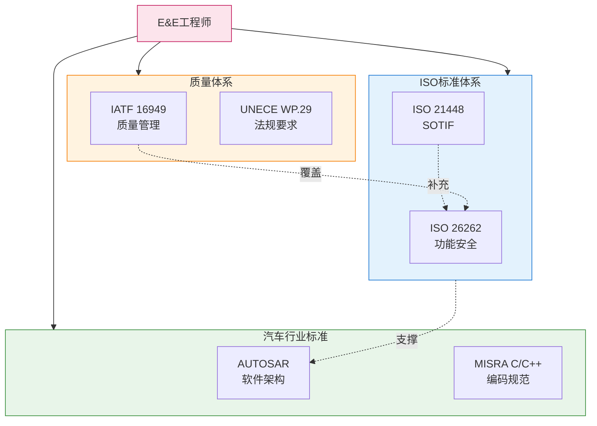
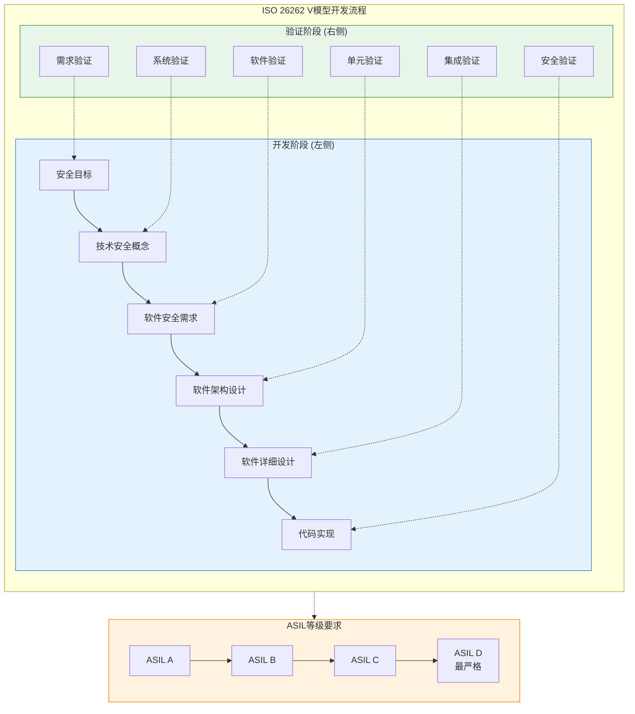
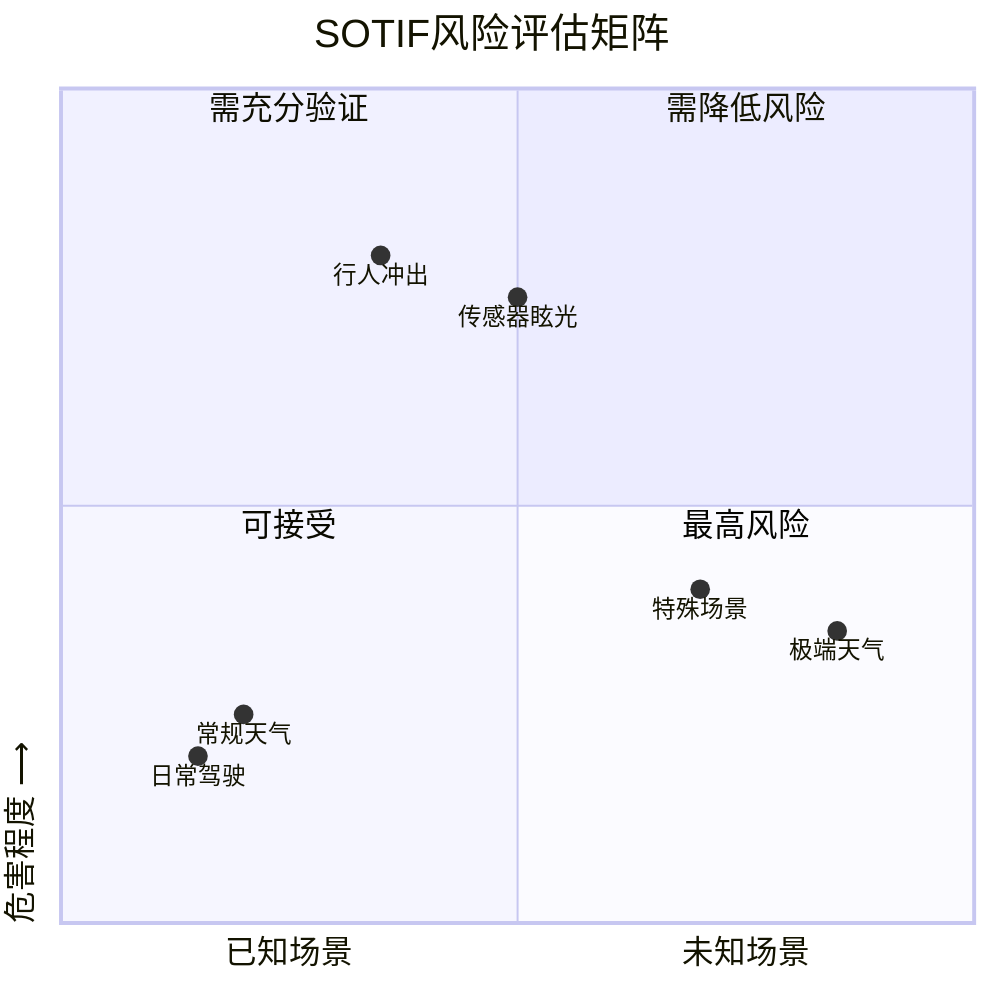
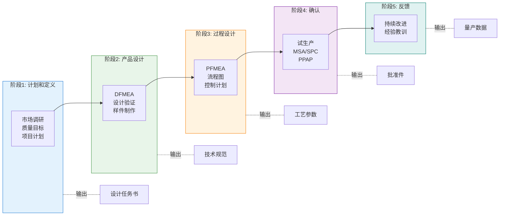
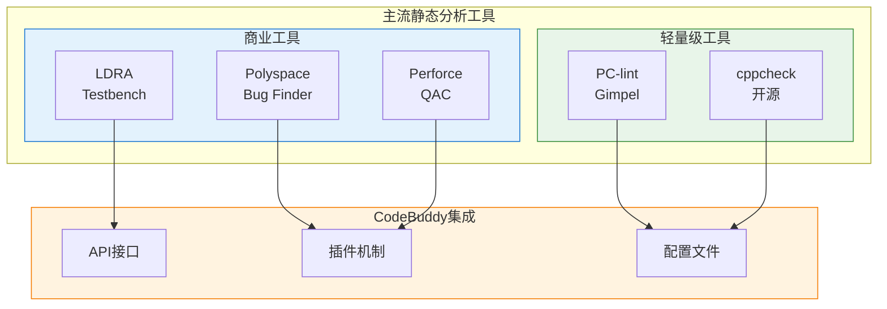
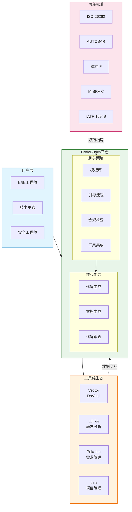

# CodeBuddy在汽车E&E场景中的应用与脚手架工程思考

## 引言：汽车软件革命与AI助手的机遇

汽车行业正在经历一场前所未有的软件革命。从机械驱动的传统汽车到软件定义汽车（Software Defined Vehicle, SDV），代码已经从辅助角色转变为决定产品核心竞争力的关键因素。根据行业数据，高端车型的软件代码量已经从2010年的约1亿行增长到2020年的1.5-2亿行，而面向自动驾驶的下一代车型预计将突破5亿行代码。这一指数级增长不仅带来了开发效率的挑战，更对软件质量、安全性和合规性提出了前所未有的要求。

对于电气与电子（E&E）工程师而言，汽车嵌入式软件开发有着独特的复杂性。不同于互联网应用的快速迭代，安全关键系统（Safety-Critical System）要求任何软件缺陷都可能导致严重的人身伤害。这意味着工程师必须在严格的约束条件下工作：满足ISO 26262功能安全要求、遵循AUTOSAR架构标准、遵守MISRA C编码规范、同时还要应对ISO 21448（SOTIF）等新兴标准的挑战。多标准叠加、长周期开发模式、复杂的工具链生态，构成了汽车E&E开发的独特景观。

AI编程助手的出现为这一困境带来了新的可能。以CodeBuddy为代表的智能编码工具能够在多个层面提升开发效率：代码补全与生成、文档自动撰写、代码审查辅助、需求分析支持。然而，汽车行业的特殊性决定了通用AI工具难以直接满足其需求——安全关键系统不允许"差不多"的代码，质量流程需要完整的可追溯性，合规性认证需要详尽的文档支持。

本文将深入探讨CodeBuddy如何在汽车E&E场景中发挥作用。我们将逐个分析ISO 26262、AUTOSAR、SOTIF、IATF16949、MISRA C等关键标准对开发流程的影响，评估当前AI工具的能力边界，并提出脚手架工程（Scaffolding）的优化方向——即如何通过预置模板、工具集成、引导流程等手段，帮助E&E工程师更高效地开发符合汽车行业标准的功能。

这不仅是一篇技术分析，更是对AI工具如何融入安全关键软件工程这一前沿命题的深度思考。

---

## 视觉元素：汽车软件代码量增长趋势

```mermaid
%%{init: {'theme': 'base'}}%%
quadrantChart
    title 汽车软件代码量增长趋势 (单位：亿行)
    x-axis 2010 --> 2025
    y-axis 代码量 --> 
    quadrant-1 未来预期 (5亿+)
    quadrant-2 当前高端 (1.5-2亿)
    quadrant-3 传统汽车 (~1亿)
    "2010年": [0.1, 0.3]
    "2020年": [0.5, 0.65]
    "2025年预期": [0.9, 0.9]
```

*图1：汽车软件代码量指数级增长趋势*

---

## 汽车E&E开发的核心挑战：标准驱动的工程实践

汽车嵌入式软件开发与互联网应用开发有着本质的不同。理解这些差异，是评估AI工具在汽车行业适用性的前提。

### 安全关键系统的严苛要求

汽车软件属于安全关键系统范畴，这意味着软件缺陷可能导致人身伤害。与传统软件工程不同，汽车行业采用V模型开发流程，每个开发阶段都有对应的验证活动：需求定义对应需求验证，系统设计对应系统验证，硬件设计对应硬件验证，软件设计对应软件验证。这种严格的对应关系保证了从需求到实现的全链路可追溯性。

更关键的是，ISO 26262标准引入了汽车安全完整性等级（Automotive Safety Integrity Level, ASIL）的概念。ASIL从A到D分为四个等级，D级代表最高安全要求。安全等级越高，需要的验证活动越严格，文档越详尽，冗余设计越复杂。例如，ASIL D级别的软件可能需要双核锁步（Lockstep）架构、运行时监控（Runtime Monitoring）、以及完整的错误处理机制。

### 多标准叠加的复杂性

汽车E&E工程师面临的另一个独特挑战是必须同时满足多个标准的要求。这些标准并非孤立存在，而是相互交织、相互支撑：

- **ISO 26262**：功能安全标准，关注系统失效导致的风险
- **ISO 21448 (SOTIF)**：预期功能安全标准，关注功能不足和误用导致的风险
- **AUTOSAR**：软件架构标准，定义软件分层和接口规范
- **MISRA C/C++**：编码规范，确保代码质量
- **IATF 16949**：质量管理体系，确保制造过程的一致性
- **UNECE WP.29**：法规要求，涵盖网络安全和软件更新

一个典型的汽车项目可能需要同时满足上述所有标准。这意味着工程师不仅要编写功能代码，还要编写符合安全要求的文档、生成符合编码规范的代码、维护需求追踪矩阵、管理配置项。

### 工具链的碎片化

汽车软件开发工具链的复杂性同样令人印象深刻。主流工具链包括Vector的DaVinci用于AUTOSAR配置、EB tresos Studio用于基础软件配置、Lauterbach和iSystem的调试器用于嵌入式调试、dSPACE和NI的硬件在环（HIL）系统用于测试、LDRA和Polyspace用于静态分析。这些工具通常来自不同供应商，数据格式各异，集成成本高昂。

AI工具如果不能与现有工具链有效集成，就只能成为开发流程中的"孤岛"，无法真正提升效率。

### 合规性成本

最后不得不提的是合规性成本。汽车软件的认证过程需要大量文档支持：安全概念、安全案例、验证计划、追溯性矩阵、测试报告等。这些文档的编写和维护往往占用工程师大量时间，而AI工具在这一领域有着天然的发挥空间。

理解这些挑战，有助于我们更准确地评估CodeBuddy在汽车E&E场景中的定位和价值。

---

## 视觉元素：汽车行业多标准叠加



*图2：汽车行业多标准叠加与相互关系*

---

## ISO 26262功能安全：CodeBuddy的支持方案与脚手架建议

ISO 26262是汽车功能安全的核心标准，定义了电气与电子系统在安全生命周期内的所有活动。对于汽车E&E工程师而言，ISO 26262不仅是一套要求，更是一种系统性的工程方法论。

### ISO 26262核心概念

ISO 26262的核心是安全目标（Safety Goal）和汽车安全完整性等级（ASIL）。安全目标源于危害分析和风险评估（HARA），定义了系统需要达到的最高安全级别。ASIL等级从A到D逐级递增，每个等级对软硬件开发有不同的要求。

**ASIL A** 适用于可能导致轻微伤害的风险，系统需要基本的安全机制；**ASIL B** 要求更强的安全机制和诊断覆盖率；**ASIL C** 需要冗余设计和更全面的验证活动；**ASIL D** 是最严格等级，可能需要双通道架构、硬件看门狗、运行时监控等高级安全机制。

### 软件开发过程的关键要求

ISO 26262 Part 6定义了软件级开发的完整流程：

1. **软件安全需求规格（Software Safety Requirements, SSR）**：从系统级安全需求派生，需要明确每个安全相关软件组件的职责、安全机制和诊断要求。

2. **软件架构设计**：需要展示安全相关的软件组件划分、模块间接口、调度策略。架构设计必须满足软件分区（Software Partitioning）要求，防止故障级联传播。

3. **软件详细设计**：详细设计文档需要描述每个软件组件的内部行为、状态机、数据流、异常处理策略。

4. **代码实现**：实现阶段需要遵循编码规范（通常基于MISRA C），并确保代码与设计的一致性。

5. **软件单元验证**：单元测试需要达到高水平的MC/DC（Modified Condition/Decision Coverage）覆盖率。

6. **软件集成验证**：集成测试验证组件间的接口正确性和交互行为。

7. **软件安全需求验证**：最终验证软件实现是否满足安全目标。

### CodeBuddy的现有能力分析

CodeBuddy作为AI编程助手，在ISO 26262场景下已有一定的应用价值：

**代码生成方面**，CodeBuddy可以生成符合MISRA C规范的代码，生成包含适当注释和安全断言的模块化代码。例如，当工程师需要实现一个看门狗模块时，CodeBuddy可以生成符合编码规范的基础框架。

**文档辅助方面**，CodeBuddy可以帮助生成软件设计说明（Software Design Description, SDD）、接口规格说明、测试用例规格等文档初稿。这能显著减轻工程师的文档负担。

**代码审查方面**，CodeBuddy可以识别潜在的安全问题，如未初始化的变量、除零错误、数组越界等常见问题。

### 脚手架工程建议

然而，现有能力远不能满足ISO 26262的严格要求。以下是CodeBuddy可以构建的脚手架工程：

#### 安全分析辅助

**FMEA/FMEDA模板生成**：故障模式与影响分析（Failure Mode and Effects Analysis, FMEA）是ISO 26262的重要活动。CodeBuddy可以预置各类汽车电子组件的FMEA模板，包括失效模式库、影响评估规则、检测措施建议等。工程师只需输入组件参数，即可生成符合ISO 26262格式的FMEA表格。

#### 安全需求追踪

**需求追踪矩阵生成**：ISO 26262要求建立从安全目标到软件需求的完整追溯链。CodeBuddy可以与需求管理工具（如Polarion、Jira、IBM Doors）集成，根据需求变更自动更新追踪矩阵，确保需求变更的可追溯性。

#### 代码注解规范

**ISO 26262合规注释模板**：安全相关代码需要详细的注释来说明安全机制的设计意图。CodeBuddy可以预置符合ISO 26262要求的代码注释模板：

```c
/**
 * @brief  看门狗服务函数
 * @details
 * - Safety Function: 检测处理器挂起并触发系统复位
 * - ASIL Level: ASIL B
 * - diagnostic coverage: 90% (target)
 * - Fault Response: 系统复位
 * @pre    看门狗硬件已初始化
 * @post   无
 * @reentrancy: Non-reentrant
 * @thread_safety: Safe
 */
void Wdg_Service(void)
{
    /* 看门狗服务实现 */
}
```

#### 安全案例框架

**Safety Case自动生成**：安全案例（Safety Case）是证明系统安全性的证据集合。CodeBuddy可以基于项目配置生成安全案例大纲，包括安全目标声明、危害分析摘要、安全需求、安全论证、验证结果等章节。

### 挑战与局限

必须认识到，AI工具无法替代安全工程师的专业判断。HARA分析、安全目标确定、ASIL等级分配等核心活动需要深入的功能安全知识和对系统的全面理解。CodeBuddy可以提供辅助，但不能替代安全专家的决策。

此外，ISO 26262认证需要第三方审计，AI生成的内容必须经过人工审核确认。工具可以提高效率，但不能降低审查的必要性。

---

## 视觉元素：ISO 26262 V模型开发流程



*图3：ISO 26262 V模型开发流程与ASIL等级*

---

在下一节，我们将深入探讨AUTOSAR架构——作为实现ISO 26262要求的软件架构框架。

---

## AUTOSAR架构：标准化开发范式与AI助手的融合

AUTOSAR（Automotive Open System Architecture）是汽车行业最重要的软件架构标准。它不仅是一套规范，更是一种全新的软件开发范式，深刻影响着汽车E&E工程师的日常工作方式。

### AUTOSAR分层架构

AUTOSAR采用经典的分层架构，从底层到顶层依次是：

**微控制器抽象层（Microcontroller Abstraction Layer, MCAL）**：这是架构的最底层，直接与硬件交互。MCAL包含驱动程序（Driver）、接口（Interface）、操作系统的低层抽象。工程师通常通过配置工具生成MCAL代码，很少直接编写。

**基础软件层（Basic Software, BSW）**：BSW是AUTOSAR的核心，包含多个功能模块组：

- **服务层（Services Layer）**：提供操作系统、内存管理、通信管理等基础服务
- **ECU抽象层（ECU Abstraction Layer）**：封装ECU级别的硬件访问
- **复杂驱动（Complex Drivers）**：处理无法标准化的特殊硬件
- **通信驱动（Communication Drivers）**：CAN、LIN、FlexRay、以太网等总线驱动

**运行时环境（Runtime Environment, RTE）**：RTE是AUTOSAR的"虚拟功能总线"（Virtual Functional Bus, VFB），负责Application软件组件（SWC）之间的通信以及SWC与BSW之间的交互。RTE通过配置工具根据SWC的端口接口自动生成。

**应用层（Application Layer）**：应用层包含多个软件组件（Software Component, SWC），每个SWC是独立的功能单元，通过端口（Port）发送和接收数据。SWC之间不直接通信，而是通过RTE抽象，这种设计实现了应用软件与基础软件的解耦。

### AUTOSAR开发流程

AUTOSAR开发与传统软件开发有显著不同：

**系统配置阶段**：定义系统约束、ECU网络拓扑、信号映射。这一阶段的输出是系统描述文件（System Description），包含所有ECU的接口和连接关系。

**ECU配置阶段**：针对单个ECU进行配置，包括BSW模块参数、RTE生成配置、通信栈配置等。主流配置工具包括Vector DaVinci、Elektrobit EB tresos Studio、KIT AUTOSAR Builder等。

**代码生成阶段**：配置工具根据配置生成BSW代码、RTE代码、接口代码。生成的代码遵循AUTOSAR标准接口，确保互操作性。

**应用开发阶段**：开发SWC应用代码。SWC可以使用AUTOSAR接口（通过RTE调用BSW服务）或标准接口（与其他SWC通信）。

**集成测试阶段**：在硬件在环（HIL）或软件在环（SIL）测试平台上验证系统功能。

### CodeBuddy在AUTOSAR场景的应用

CodeBuddy可以在多个层面支持AUTOSAR开发：

**RTE接口代码生成**：当SWC的端口接口定义完成后，CodeBuddy可以辅助生成RTE相关的接口调用代码。例如，根据ARXML接口描述生成Sender-Receiver或Client-Server通信代码：

```c
/* RTE调用示例 - Sender-Receiver接口 */
#include "Rte_<ComponentName>.h"

/* 发送数据到另一个SWC */
void <ComponentName>_SendData(uint16 dataId, const uint8* data, uint16 length)
{
    Std_ReturnType ret = Rte_Write_<PortName>_<DataElementName>(data);
    if (E_OK != ret) {
        /* 错误处理 */
        Det_ReportError(MODULE_ID, INSTANCE_ID, API_ID, ERROR_XXX);
    }
}
```

**BSW模块配置建议**：当工程师配置BSW模块时，CodeBuddy可以提供配置建议。例如，配置CAN通信栈时，CodeBuddy可以建议合理的仲裁位速率、采样点位置、过滤器配置等参数。

**Application组件模板**：CodeBuddy可以预置各类AUTOSAR SWC模板，包括传感器组件、执行器组件、算法组件等，帮助工程师快速创建符合AUTOSAR规范的应用代码结构。

### 脚手架工程建议

为更好地支持AUTOSAR开发，CodeBuddy可以构建以下脚手架：

#### AUTOSAR配置模板库

预置各类AUTOSAR配置模板，包括：
- BSW模块配置模板（CAN、LIN、Ethernet、OS等）
- RTE配置模板（通信接口、运行实体调度）
- SWC组件模板（不同类型组件的ARXML描述）

#### 接口契约生成器

基于功能需求自动生成SWC的ARXML接口描述，定义：
- 端口接口（Sender-Receiver、Client-Server、NvData等）
- 数据元素（Data Element）
- 操作（Operation）
- 参数（Parameter）

#### 代码与配置同步检查

AUTOSAR开发中，代码实现必须与配置保持一致。CodeBuddy可以实现：
- 头文件接口与ARXML接口的一致性检查
- 运行实体（Runnables）与代码函数的映射验证
- 数据一致性的交叉检查

#### 符合AUTOSAR规范的代码风格检查

AUTOSAR对代码有特定的命名规范和结构要求。CodeBuddy可以：
- 验证接口函数命名符合AUTOSAR规范
- 检查模块结构是否符合AUTOSAR标准
- 验证错误代码定义与规范一致

#### 与主流工具链的集成

CodeBuddy需要与主流AUTOSAR工具链集成：
- **Vector DaVinci**：支持DaVinci配置文件的解析和生成
- **EB tresos Studio**：支持EB配置格式
- **AUTOSAR Builder**：支持开源AUTOSAR工具链

通过插件机制，CodeBuddy可以直接读取和修改这些工具的配置数据，实现深度集成。

---

## 视觉元素：AUTOSAR分层架构

```mermaid
flowchart TB
    subgraph App["应用层 Application Layer"]
        SWC1[软件组件1<br/>SWC]
        SWC2[软件组件2<br/>SWC]
        SWC3[软件组件3<br/>SWC]
    end
    
    subgraph RTE["运行时环境 RTE"]
        RTE[RTE<br/>虚拟功能总线]
    end
    
    subgraph BSW["基础软件层 BSW"]
        direction TB
        Services[服务层<br/>Services]
        ECUAbstr[ECU抽象层<br/>ECU Abstraction]
        ComDrv[通信驱动<br/>Communication]
        ComplexDrv[复杂驱动<br/>Complex Drivers]
    end
    
    subgraph MCAL["微控制器抽象层 MCAL"]
        MCAL[MCAL<br/>驱动程序]
    end
    
    App --> RTE
    RTE --> BSW
    BSW --> MCAL
    
    SWC1 -.->|Port接口| RTE
    SWC2 -.->|Port接口| RTE
    SWC3 -.->|Port接口| RTE
    
    style App fill:#e1f5fe,stroke:#0277bd
    style RTE fill:#e8f5e9,stroke:#2e7d32
    style BSW fill:#fff3e0,stroke:#ef6c00
    style MCAL fill:#fce4ec,stroke:#c2185b
```

*图4：AUTOSAR分层架构*

---

了解了AUTOSAR架构之后，让我们转向另一个重要标准——SOTIF，它是ISO 26262的重要补充，专注于预期功能安全。

---

## SOTIF预期功能安全：超越传统功能安全的视角

ISO 21448（即SOTIF，Safety Of The Intended Functionality）是近年来汽车行业最重要的新标准之一。它关注的是"系统功能本身是否足够安全"，而非"系统是否按设计运行"。

### SOTIF与ISO 26262的关系

理解SOTIF首先要理解它与ISO 26262的区别与互补：

**ISO 26262** 关注的是**系统性失效**（Systematic Failure）和**随机硬件失效**（Random Hardware Failure）。系统性失效源于设计或实现错误，通过严格的设计流程和验证可以消除；随机硬件失效是硬件随机发生的故障，可以通过冗余和诊断机制降低风险。

**SOTIF** 关注的则是**功能不足**（Functional Insufficiency）和**误用**（Misuse）。即使系统完全按照设计运行，在某些场景下仍可能导致不安全。例如，摄像头的视觉感知算法可能在特定光照条件下误识别物体，这种"功能不足"并非系统失效，而是系统能力边界导致的。

一个完整的汽车安全策略需要同时考虑ISO 26262和SOTIF：

| 维度 | ISO 26262 | SOTIF |
|------|-----------|-------|
| 关注对象 | 系统失效 | 功能不足、误用 |
| 触发因素 | 硬件失效、软件bug | 场景corner case |
| 风险评估 | 失效率、危害程度 | 场景暴露度、触发概率 |
| 目标 | 消除系统性失效 | 减少未知危害场景 |

### SOTIF核心概念

SOTIF引入了多个关键概念，帮助工程师系统性地分析和应对非传统安全风险：

**已知安全场景（Known Safe Scenarios）**：系统能够正确处理且不会导致危害的场景。这些场景是日常驾驶的主体。

**已知危险场景（Known Unsafe Scenarios）**：已知会导致危害的场景，需要通过设计手段降低风险。例如，行人突然冲出时的AEB（自动紧急制动）响应。

**未知安全场景（Unknown Safe Scenarios）**：系统行为正确但工程师尚未识别为安全的场景。需要通过大量测试和验证来证明其安全性。

**未知危险场景（Unknown Unsafe Scenarios）**：最危险的类别——系统可能产生危害，但工程师尚未意识到。这是SOTIF全力降低的风险区域。

**触发条件（Triggering Conditions）**：导致系统不安全行为的特定条件。常见的触发条件包括：
- 传感器眩光（摄像头被强光照射）
- 极端天气（暴雨、暴雪、大雾）
- 特殊交通场景（隧道出口、逆光）
- 传感器脏污或遮挡

### SOTIF开发活动

SOTIF开发包括以下关键活动：

**场景库构建**：建立全面的驾驶场景数据库，包括正常场景和边界场景。场景库是SOTIF分析的基础。

**功能不足识别**：分析系统功能在各类场景下的表现，识别可能的不足。

**触发条件分析**：识别可能导致不安全行为的触发条件，评估其可能性和潜在危害。

**危害和风险评估**：类似于HARA但专注于SOTIF场景，评估已知和未知危害的风险级别。

**安全目标定义**：基于风险评估，定义SOTIF安全目标。

**验证与确认**：通过仿真、测试场测试、实际道路测试等方式验证系统安全性。

### CodeBuddy对SOTIF的支持

#### 场景描述生成

SOTIF需要大量场景描述。CodeBuddy可以：
- 基于自然语言描述生成结构化场景
- 扩展场景变体（天气、光照、交通参与者等）
- 生成场景的边界条件描述

#### 触发条件分析辅助

CodeBuddy可以：
- 分析系统功能边界，列出可能的触发条件
- 基于类似系统的已知问题推断潜在风险
- 生成触发条件分析的检查清单

#### SOTIF日志分析

自动驾驶系统会生成大量日志。CodeBuddy可以：
- 分析日志中的异常行为模式
- 识别可能导致安全问题的corner case
- 生成日志分析报告

### 脚手架工程建议

#### SOTIF分析模板

预置SOTIF分析模板，包括：
- 场景库模板（结构化场景描述格式）
- 触发条件识别清单
- 危害评估矩阵

#### 场景库辅助构建

基于功能描述，CodeBuddy可以：
- 自动生成初始场景集合
- 识别场景中的变量参数
- 扩展场景到边界条件

#### Safety Case中SOTIF章节生成

Safety Case需要包含SOTIF论证。CodeBuddy可以：
- 生成SOTIF章节大纲
- 填充场景分析摘要
- 生成验证结果报告模板

### SOTIF与AI/ML的关联

SOTIF在自动驾驶领域的兴起与AI/ML技术的广泛应用密切相关。神经网络的安全性论证是一个巨大挑战：我们很难解释为什么神经网络在某些情况下做出特定决策。这种"黑箱"特性使得传统的安全分析方法难以直接应用。

CodeBuddy未来可能需要支持：
- 神经网络决策的可解释性分析
- 训练数据覆盖度评估
- 未知输入的鲁棒性分析

这一领域仍在快速发展，AI工具的支持也处于探索阶段。

---

## 视觉元素：SOTIF场景分类



*图5：SOTIF已知/未知危害场景分析*

---

探讨完SOTIF，让我们转向汽车行业质量体系的核心标准——IATF 16949，了解质量管理流程对软件开发的影响。

---

## IATF 16949质量管理：融入APQP流程

IATF 16949是国际汽车特别工作组（IATF）制定的汽车行业专用质量管理体系标准。它基于ISO 9001，但在汽车行业的特殊需求上进行了扩展。对于软件开发团队而言，理解IATF 16949及其核心工具，是高效融入汽车供应链的前提。

### IATF 16949概述

IATF 16949适用于汽车供应链中的组织，涵盖了设计、开发、生产、安装和服务全过程。该标准强调：
- 缺陷预防而非缺陷检测
- 减少变异和浪费
- 持续改进
- 顾客特殊要求（Customer-Specific Requirements, CSR）的满足

IATF 16949要求组织建立并维护多个核心工具，包括FMEA、MSA、SPC、APQP和PPAP。

### APQP流程

产品质量策划（Advanced Product Quality Planning, APQP）是IATF 16949的核心流程之一，包含五大阶段：

**第一阶段：计划和定义**

此阶段的目标是确定顾客需求和期望，建立质量目标。主要活动包括：
- 市场调研和顾客需求分析
- 产品目标和质量目标设定
- 项目计划和里程碑定义
- 跨职能团队组建

输出包括：设计任务书、项目计划、质量目标等。

**第二阶段：产品设计开发**

此阶段完成产品的设计和验证：
- 设计失效模式与影响分析（Design FMEA, DFMEA）
- 设计验证计划和报告（Design Verification Plan and Report, DVPR）
- 样件制作和验证
- 设计评审

输出包括：工程图纸、技术规范、DFMEA报告、DVPR等。

**第三阶段：过程设计开发**

此阶段完成制造过程的设计：
- 过程失效模式与影响分析（Process FMEA, PFMEA）
- 流程图和工艺平面布置图
- 过程参数定义
- 控制计划（Control Plan）制定

输出包括：PFMEA、流程图、控制计划等。

**第四阶段：产品和过程确认**

此阶段验证批量生产能力：
- 试生产（Trial Run）
- 测量系统分析（Measurement System Analysis, MSA）
- 统计过程控制（Statistical Process Control, SPC）实施
- 生产件批准程序（Production Part Approval Process, PPAP）

输出包括：MSA报告、SPC数据、PPAP提交件等。

**第五阶段：反馈、评定和纠正措施**

此阶段实现持续改进：
- 生产阶段数据收集和分析
- 顾客满意度评估
- 问题识别和纠正措施实施
- 经验教训总结

### CodeBuddy在质量流程中的应用

CodeBuddy可以在以下方面支持IATF 16949相关工作：

#### 设计FMEA辅助

DFMEA（Design FMEA）是产品设计阶段的关键质量工具。CodeBuddy可以：
- 根据产品功能描述生成DFMEA初稿
- 建议常见的失效模式
- 提供严重度、发生度和检测度的评估建议

#### 控制计划文档生成

控制计划（Control Plan）描述了制造过程中的关键控制点。CodeBuddy可以：
- 基于PFMEA生成控制计划初稿
- 建议关键特性的控制方法
- 模板化控制计划格式

#### 过程作业指导书生成

操作指导书（Work Instructions）是生产现场的参考文档。CodeBuddy可以：
- 基于工艺参数生成操作步骤
- 包含安全注意事项
- 格式化工单和检查表

### 脚手架工程建议

#### 质量文档模板库

预置IATF 16949要求的各类文档模板：
- DFMEA模板（符合AIAG-VDA标准）
- PFMEA模板
- 控制计划模板
- PPAP提交件检查清单

#### APQP各阶段交付物模板

APQP各阶段有明确的交付物要求。CodeBuddy可以：
- 生成各阶段交付物清单
- 提供交付物模板
- 追踪交付物完成状态

#### 追溯性矩阵生成工具

IATF 16949强调从需求到实现的完整追溯。CodeBuddy可以：
- 关联需求与设计
- 关联设计与测试
- 生成追溯性矩阵

#### 与质量管理系统集成

CodeBuddy可以与主流质量管理系统集成：
- 需求管理工具（Polarion、Jira）
- 测试管理工具（TestRail、qTest）
- PLM系统（Teamcenter、ENOVIA）

通过API集成，实现数据的自动流动和追溯。

---

## 视觉元素：APQP产品质量策划流程



*图6：IATF 16949 APQP五大阶段流程*

---

质量管理流程之后，让我们聚焦汽车行业代码层面的核心标准——MISRA C编码规范，这是确保代码质量的基础。

---

## MISRA C编码规范：静态分析与合规性保障

MISRA C是汽车行业最重要的编码规范，被广泛应用于安全关键嵌入式系统的开发。它不仅是一套规则，更是汽车软件质量的基础保障。

### MISRA C概述

MISRA C最初于1998年发布，最初版本针对汽车行业的C语言编程。经过多次修订，MISRA C:2012已成为行业标准，被广泛认可为汽车嵌入式软件的最佳实践。

MISRA C的核心价值在于：
- **减少语言危险特性**：C语言有许多未定义行为和容易出错的特点，MISRA C通过限制这些特性来提高代码安全性
- **提高代码可读性**：一致的编码风格使代码更易理解和维护
- **支持静态分析**：规则设计允许通过自动化工具进行检查
- **满足认证要求**：ISO 26262等标准认可MISRA C作为合规编码规范

### MISRA C:2012规则分类

MISRA C:2012包含143条规则，分为四类：

**强制规则（Mandatory Rules）- 14条**：必须遵守，不允许任何偏差。例如：
- 规则1.1：程序不应包含对超出范围的整数常量的读取
- 规则1.2：不使用汇编语言

**必需规则（Required Rules）- 122条**：应遵守，如有偏差需要正式记录和审批。例如：
- 规则8.2：函数应使用函数原型声明
- 规则8.9：如果对象在声明后未被修改，则应使用const限定符
- 规则17.2：不应使用指针运算

**建议规则（Advisory Rules）- 43条**：推荐遵守。例如：
- 规则8.5：嵌套包含文件的数量应受到限制

**文档规则（Dec_rules）- 1条**：要求提供文档说明

此外，规则还按违反后果分为：
- **违反规则1**：违反会导致未定义行为
- **违反规则2**：违反会导致可疑行为

### 合规性工作流程

MISRA C合规是一个系统性的过程：

**规则映射**：将MISRA规则映射到项目的编码规范中，定义哪些规则适用、哪些不适用。

**静态分析**：使用自动化工具扫描代码，识别规则违反。主流工具包括LDRA Testbench、Polyspace Bug Finder、Gimpel PC-lint、Perforce QAC等。

**偏差管理**：对于必须保留的违反项，需要记录偏差原因、影响评估和缓解措施，由技术权威批准。

**合规报告**：生成合规矩阵，显示每条规则的遵守状态。

**认证准备**：准备审计材料，包括编码规范、合规报告、偏差记录等。

### CodeBuddy的现有能力

CodeBuddy在MISRA C合规方面已有一定能力：

**代码生成时检查**：在生成代码时，CodeBuddy可以遵循MISRA C规则，生成符合规范的初始代码。例如，避免隐式转换、使用正确的类型、使用花括号明确代码块等。

**规则解释**：CodeBuddy可以解释MISRA规则的要求，帮助工程师理解规则意图。

**修复建议**：对于常见的规则违反，CodeBuddy可以提供修复建议。

### 脚手架工程建议

#### 实时MISRA检查器

CodeBuddy可以集成到IDE中，提供实时MISRA检查：

- 在编写代码时即时检查规则违反
- 鼠标悬停显示规则解释
- 一键修复常见问题

#### 规则解释与修复建议生成

为每条MISRA规则提供：
- 详细的中文解释
- 违规示例和正确示例
- 修复步骤

#### 合规性报告自动生成

自动生成符合审计要求的合规报告：
- 合规矩阵（规则 vs. 文件 vs. 状态）
- 偏差汇总
- 趋势分析

#### 代码审查清单生成

生成代码审查专用的MISRA检查清单，支持审查人员系统性地检查代码。

#### 静态分析工具集成

CodeBuddy可以与主流静态分析工具深度集成：

| 工具 | 供应商 | 集成方式 | 主要功能 |
|------|--------|----------|----------|
| LDRA Testbench | LDRA | API | 完整MISRA分析 |
| Polyspace | MathWorks | Plugin | 形式化验证 |
| PC-lint | Gimpel | 配置文件 | 快速检查 |
| QAC | Perforce | Plugin | 自动化报告 |

#### 挑战：100%合规的可能性

必须指出，AI生成的代码要达到100% MISRA合规是极其困难的。原因是：

1. **语言复杂性**：MISRA规则众多且相互关联，AI难以在生成时考虑所有约束
2. **性能权衡**：某些合规代码可能导致性能开销，在嵌入式系统中难以接受
3. **架构限制**：与现有代码集成时，必须保持接口兼容

更现实的目标是：
- **高合规率**：例如95%以上
- **可管理的偏差**：剩余5%通过正式偏差流程处理
- **持续改进**：逐步降低违规率

---

## 视觉元素：MISRA C静态分析工具对比



*图7：MISRA C静态分析工具与CodeBuddy集成方式*

---

详细了解MISRA C编码规范之后，让我们在下一节总结脚手架工程建议，提出CodeBuddy深度定制的具体方向。

---

## 脚手架工程建议：CodeBuddy的深度定制方向

基于前述对汽车行业各标准的深入分析，本节将综合提出CodeBuddy在汽车E&E领域的脚手架工程优化建议。这些建议涵盖代码生成、文档生成、工具链集成、培训引导和质量保证等多个层面。

### 脚手架工程的核心价值

在深入具体建议之前，有必要明确脚手架工程（scaffolding）在AI辅助开发中的核心价值。脚手架不仅是一组预设模板，更是一种系统性的工程方法：通过预置规范、引导流程、自动化检查，降低工程师使用AI工具的门槛，同时确保输出符合行业标准。

对于汽车行业而言，脚手架工程的价值尤为突出：它帮助工程师在享受AI效率提升的同时，满足严格的安全、合规和质量要求。

### 代码生成层面

#### 汽车行业专用代码模板库

CodeBuddy应建立全面的汽车行业代码模板库，涵盖：

**安全相关模块模板**：看门狗管理、内存管理、通信错误处理、诊断服务等。这些模板应内嵌安全机制、符合ISO 26262要求、包含完整的注释规范。

```c
/**
 * @brief 安全相关模块模板 - 看门狗管理
 * @template_id: WDGM_001
 * @ ASIL: B
 * @version: 1.0
 */
```

**AUTOSAR组件模板**：标准SWC结构、BSW模块接口、复杂驱动框架。模板应遵循AUTOSAR规范、包含RTE调用示例、符合命名规范。

**通信协议栈模板**：CAN、LIN、Ethernet、FlexRay等协议的初始化、发送、接收处理框架。

#### AutoSAR BSW模块生成器

针对AUTOSAR基础软件，CodeBuddy可以开发专用的代码生成器：

- **CanIf模块配置生成器**：根据硬件配置生成CanIf模块参数
- **Com模块信号处理生成器**：根据信号定义生成信号处理代码
- **NvM模块配置生成器**：生成NvM相关的配置和接口代码

#### 安全相关代码模式

提供经过验证的安全代码模式：

- **内存安全**：缓冲区边界检查、堆栈保护
- **异常处理**：错误传播机制、看门狗触发逻辑
- **数据一致性**：关键数据的冗余存储和校验

### 文档生成层面

#### ISO 26262安全文档模板

安全相关项目需要大量文档。CodeBuddy可以预置以下模板：

- **软件安全需求规格（Software Safety Requirements Specification, SSRS）**：模板包含安全目标、ASIL分解、安全机制需求等章节结构
- **软件架构设计说明**：模块划分、接口定义、安全机制描述
- **软件详细设计说明**：组件行为、状态机、数据流
- **验证计划与报告**：测试用例模板、测试结果记录格式

#### AutoSAR接口描述文档

根据ARXML自动生成接口文档：
- 组件接口说明
- 数据类型定义
- 接口使用示例

#### SOTIF分析报告模板

SOTIF作为新兴标准，工程师往往缺乏经验。CodeBuddy可以提供：

- 场景分析模板
- 触发条件识别清单
- 危害评估矩阵

#### IATF 16949质量文档

质量管理文档同样可以模板化：

- DFMEA/PFMEA表格模板
- 控制计划模板
- PPAP提交件检查清单

### 工具链集成层面

#### Vector工具链集成

Vector是汽车行业最大的工具供应商，DaVinci配置工具广泛应用于AUTOSAR开发。CodeBuddy可以：

- 解析DaVinci配置文件（.dbc, .arxml）
- 验证配置一致性
- 生成配置差异报告

#### 静态分析工具集成

与主流静态分析工具的集成是MISRA合规的关键：

- **LDRA Testbench**：完整MISRA分析
- **Polyspace**：形式化验证
- **PC-lint**：快速检查
- **QAC**：自动化报告

集成方式可以是：
- 读取分析结果，识别问题
- 根据问题提供修复建议
- 验证修复后的合规状态

#### 需求管理工具集成

需求可追溯性是ISO 26262的核心要求。CodeBuddy可以与以下工具集成：

- **Polarion**：ALM和需求管理
- **IBM Doors**：企业级需求管理
- **Jira**：敏捷开发平台
- **Confluence**：文档管理

### 培训与引导层面

#### 新手引导流程

针对刚进入汽车行业的工程师，CodeBuddy可以提供引导式工作流：

1. **项目初始化**：询问项目类型、目标ASIL等级、目标平台
2. **标准选择**：根据项目要求推荐需要满足的标准
3. **模板选择**：推荐适合的代码和文档模板
4. **流程引导**：分步骤引导完成开发任务

#### 标准解释助手

汽车行业标准众多且复杂。CodeBuddy可以扮演标准助手的角色：

- 解释ISO 26262概念和术语
- 回答AUTOSAR规范问题
- 提供MISRA规则的中文解释
- 解释IATF 16949流程要求

#### 最佳实践知识库

积累和分享汽车行业的最佳实践：

- 典型问题及其解决方案
- 代码审查常见问题
- 配置调优经验

### 质量保证层面

#### 自动化的合规检查

在代码生成过程中嵌入合规检查：

- MISRA规则实时检查
- 命名规范检查
- 注释完整性检查

#### 代码审查辅助

辅助人类代码审查：

- 生成审查要点清单
- 识别潜在问题
- 提供修复建议

#### 追溯性检查

确保需求到代码的完整追溯：

- 需求覆盖度分析
- 测试用例追溯
- 配置项管理

### 实施建议

#### 优先级建议

建议按以下优先级实施：

1. **高优先级**：MISRA C检查器、安全注释模板、代码审查辅助
2. **中优先级**：AUTOSAR模板库、IATF 16949文档模板、需求追溯工具
3. **低优先级**：SOTIF分析工具、与Vector工具链深度集成

#### 迭代策略

脚手架工程应采用迭代策略：

1. **第一阶段**：建立基础模板库，聚焦最常用的代码模板和文档模板
2. **第二阶段**：集成静态分析工具，实现代码生成的实时合规检查
3. **第三阶段**：开发高级功能，如SOTIF分析辅助、与工具链深度集成

#### 用户反馈驱动

持续收集用户反馈，优化脚手架：

- 分析用户常用的模板
- 追踪合规问题来源
- 收集功能改进建议

---

## 视觉元素：CodeBuddy脚手架工程架构



*图8：CodeBuddy汽车行业脚手架工程整体架构*

---

## 总结与展望

汽车行业正在经历软件定义汽车的深刻转型。代码量从数千万行到数亿行的指数级增长、多标准叠加的复杂性、安全关键系统的严苛要求，构成了汽车E&E开发的独特挑战。在这一背景下，AI编程助手如CodeBuddy既面临着前所未有的机遇，也承受着独特的压力。

本文系统分析了CodeBuddy如何在汽车E&E场景中提供有效支持。在ISO 26262功能安全层面，CodeBuddy可以辅助生成安全文档、提供合规注释模板、协助代码审查；在AUTOSAR架构层面，CodeBuddy可以提供组件模板、配置建议、接口生成器；在SOTIF层面，CodeBuddy可以辅助场景分析、触发条件识别；在IATF 16949质量管理层面，CodeBuddy可以提供FMEA模板、控制计划模板、追溯性矩阵；在MISRA C编码规范层面，CodeBuddy可以集成静态分析工具、提供实时检查、生成合规报告。

脚手架工程是将AI工具潜力转化为实际生产力的关键。通过预置汽车行业专用模板、规范引导流程、自动化合规检查，CodeBuddy可以在不牺牲质量的前提下显著提升开发效率。

然而，必须认识到AI工具的局限性：它可以提高效率，但不能替代安全工程师的专业判断；它可以生成代码，但无法对安全目标负责；它可以辅助合规，但不能替代认证流程。AI是强大的助手，但安全关键的决策仍需人类完成。

展望未来，CodeBuddy在汽车行业有几个值得关注的发展方向：

**更深度的主流工具链集成**：与Vector、Elektrobit等主流工具的深度集成，将使CodeBuddy真正融入工程师的日常工作流。

**基于大模型的安全分析能力**：随着大模型技术的发展，CodeBuddy或许能够承担更复杂的分析任务，如基于上下文的危害分析、基于场景的安全论证。

**跨标准的一致性检查**：开发能够同时检查多标准合规性的工具，从整体视角确保系统满足所有要求。

**行业特定的微调模型**：针对汽车行业标准和用例进行专门训练的模型，将提供更准确、更专业的支持。

对于正在考虑将CodeBuddy引入汽车E&E开发团队的决策者，我们的建议是：

1. **从小处着手**：选择文档生成、代码模板等低风险场景开始试点
2. **建立反馈循环**：收集工程师的使用体验，持续优化脚手架配置
3. **关注合规流程**：将AI工具输出纳入现有的审查和合规流程
4. **保持开放心态**：AI工具将快速演进，今天的局限可能就是明天的标配

汽车软件开发的未来，离不开AI工具的深度参与。CodeBuddy及其脚手架工程，代表着这一趋势的重要方向。关键在于，我们如何智慧地利用这些工具，在提升效率的同时守护安全。
