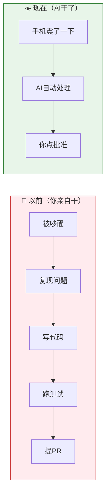
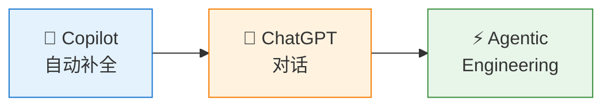
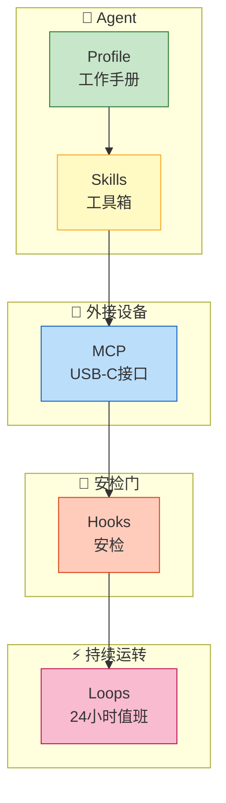
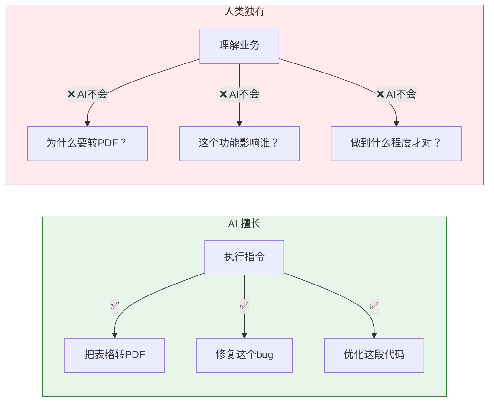
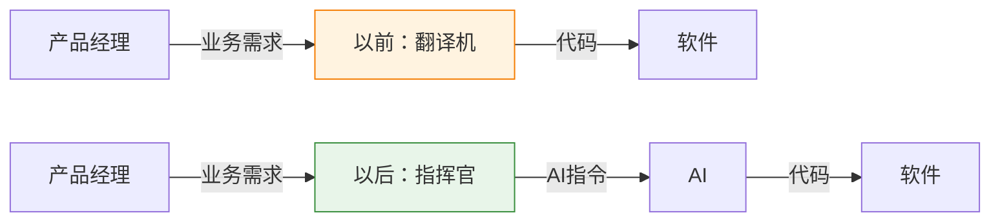

# 什么是 Agentic Engineering？一个故事讲透

---

凌晨 3 点 12 分，你的手机震了一下。

你模模糊糊摸到手机，屏幕上是一条 GitHub 邮件提醒——你维护的那个 800 星的小项目，有人提了一个新 issue："希望支持 Markdown 表格转 PDF。"

你叹了口气，准备爬起来。却发现——

> ✅ PR 已经提了  
> ✅ 测试已经跑了  
> ✅ 代码已经 review 过了

你揉揉眼睛，以为自己在做梦。点开一看，commit message 写得工工整整，测试用例一个没少，PR 描述里还@感谢了提交者。

你躺回床上，翻了个身，继续睡。

第二天早上 8 点，你泡了杯咖啡，点了一下 "Approve"。

这不是科幻。这是 2026 年的真实场景。

*图1：以前 vs 现在——AI 帮你干了多少活*

**那这一切，是怎么发生的？**

---

## 从"随叫随到的助手"，到"有自己工位的员工"

过去三年，AI 编程经历了三波浪潮。

*图2：AI 编程的三个时代*

**第一波：Copilot 自动补全。** 你写一行代码，它帮你补半行。就像有个 pair programming 的同事，你写它补，配合默契。但它记不住你项目的规矩。

**第二波：ChatGPT 对话。** 你问它答，像个资深同事。你让它写个函数，它给你写一个；你让它改个 bug，它给你改一个。但这就像个"随叫随到的助手"——你叫它就来，你关掉对话，它就忘了你是谁。

问题来了：

- 它记不住你项目的编码规范。
- 你关掉聊天窗口，它的"思路"就断了。
- 它能写代码，但不会自己 push；能跑测试，但不会自己提 PR。

**这就是"对话式编程"的三个天花板——Agent 是个助手，不是个员工。**

助手在你召唤时存在。员工有自己的工位、自己的工具、自己对流程的承诺。

**Agentic Engineering，就是给 Agent 配齐这一切。**

---

## 核心五件套：让 AI 有工位、有工具、有同事

想象你开了家公司。新员工入职，你给他配了什么？

*图3：Agentic Engineering 五件套*

**1. 一本工作手册（Agent Profile）**

里面写着："我们用 CommonJS 别用 ES Module"、"测试必须跑 npm test"、"commit message 要用 feat: 前缀"。Agent 永远记得这些规矩，不用你每次都重复。

**2. 一个工具箱（Skills）**

团队里有个老司机，特别擅长处理 PDF。你把他的"绝活"沉淀成一个"技能包"。下次遇到 PDF 相关的事，Agent 直接调这个技能，不用从零学起。

**3. 一套外接设备（MCP）**

以前 Agent 只能在你给它"打电话"时工作。现在它自己能操作 GitHub、能跑命令行、能控制浏览器——就像手机从只能打电话，变成能插 USB-C 接各种设备。

**4. 几道安检门（Hooks）**

机场过安检，值机前检查一次，登机前再检查一次。Agent 写完代码要 commit？先过 lint 检查。准备 push？先跑测试。全通过才能往下走。

**5. 一个24小时值班的员工（Loops）**

以前你叫它才动。现在它 7×24 盯着——有人提 issue？自动处理。有人开 PR？自动 review。不用你催，它自己干活。

**这五件套拼起来，就是一台"自动开发机"。**

---

## Agent 能替换谁

配齐了五件套，Agent 就能"上岗"了。

它能帮你干哪些活？

**1. coder（写代码的）** — 替代程度：⭐⭐⭐⭐⭐

它自己读 issue、自己拆解任务、自己写代码、改 bug、跑测试、提 commit。

一个真实案例：用户提了句"希望支持表格转 PDF"，Agent 自己分析需求、自己写 src/table.js、自己补测试、自己跑 npm test 全绿、自己提了 PR。全程 21 分钟。

**2. reviewer（审代码的）** — 替代程度：⭐⭐⭐⭐

它自动扫 diff，给你列一堆修改意见。哪里代码不规范、哪里测试没覆盖、哪里有安全风险——它比人工审得还细。而且它不会累，24小时干活不抱怨。

**3. tester（写测试的）** — 替代程度：⭐⭐⭐⭐

边界情况容易漏？Agent 自动补测试用例。空文件、超大文件、非正常输入——它能帮你想到一堆"角落里的场景"。

**4. docs-writer（写文档的）** — 替代程度：⭐⭐⭐

每次发版都要更新 README、CHANGELOG？Agent 自动帮你写。commit message 里的 feat: xxx，它自动抽出来整理成 changelog。

**以前是你写代码，AI 帮你补。现在是 AI 写代码，你只负责点"批准"。**

---

## 为什么"懂业务"变成了最稀缺的能力

但这里有个关键问题——

AI 能写代码了，**谁来告诉它写什么？**

你会发现一个有趣的现象：AI 很擅长执行，但不擅长理解。

*图5：AI 的能力边界*

你让它"把表格转成 PDF"，它能写。但它不知道——

- 为什么要转 PDF？是给客户发报告用？
- 表格里有哪些列？是财务数据还是用户列表？
- 转成什么样才算对？需要分页吗？需要页眉吗？

**AI 知道"怎么做"，但不知道"为什么做"。**

这就回到了最根本的问题：**谁能先把业务讲清楚？**

以前，程序员是"翻译机"——把产品经理的想法翻译成代码。  
以后，程序员是"指挥官"——把业务需求翻译成 AI 指令。

*图6：程序员角色转变*

**以前最稀缺的是"会写代码的手"。**  
**以后最稀缺的是"懂业务的大脑"。**

当你比产品经理更懂业务，当你比任何人都清楚"这个功能为什么要做、做到什么程度、影响哪些流程"——你就变成了不可替代的人。

你不需要亲手写代码，但你需要下达精准的指令。

**这就是 AI 时代，程序员最大的机会。**

---

## 三个建议，帮你抓住这波机会

说了这么多，怎么开始？

**建议 1：学业务，别只学技术**

技术会过时，AI 会进化。但你对业务的理解，是别人拿不走的。当你比产品经理更懂业务时，你就是 AI 的"翻译官"——只有你能把业务需求准确传达给 AI。

**建议 2：用起来**

去装个 CodeBuddy，花半小时写一个 AGENT.md。不用搞多复杂——就写写你项目的规矩、你团队的规范。试试让 AI 自己跑一次 test、自己提一次 PR。

**建议 3：把自己当成"指挥官"**

以后问 AI"这个功能怎么实现"之前，先问自己三遍"为什么要做"。想清楚了，再下达指令。

---

AI 时代，最值钱的不是会写代码的手，而是懂业务的大脑。

**去成为那个"指挥官"吧。**

---

## Metadata

- **Word Count:** 1680
- **Reading Time:** ~5 分钟
- **Target Audience:** 软件工程从业者、产品经理、技术爱好者
- **Core Message:** Agentic Engineering 不是让 Agent 更聪明，而是给它配齐"工位、工具、同事"，让它能独自跑完开发流水线。随着开发门槛下降，"深度熟悉业务"变成了程序员最不可替代的能力。
- **Published:** 公众号
