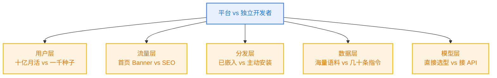
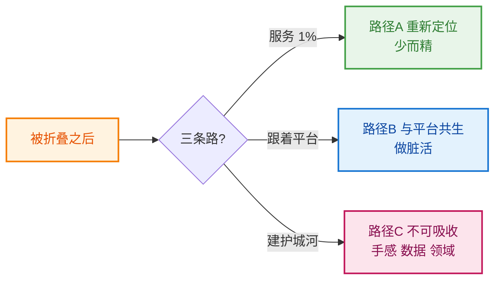

## Metadata

- **Word Count:** 2920
- **Reading Time:** ~10 分钟
- **Target Audience:** 公众号订阅者（技术 / 产品 / 创业圈为主，含一般读者）
- **Core Message:** 被淘汰是独立开发者的常态。认清这件事，胜过死磕一个注定赢不了的方向。
- **Tone:** 自嘲 + 真诚 + 冷静分析
- **金句：** 被折叠不可怕，可怕的是你手里没有不可被折叠的东西。
- **Published:** 待发布

---

# 用三个晚上做的小工具，被 WorkBuddy 一夜归零了

<!-- 朋友圈截图（用户 2026-07-31 提供）
     - 内容：朋友圈原文 #1 + WorkBuddy 新闻稿卡片
     - 保存路径：docs/writing/assets/2026-07-31-when-platform-absorbs-you/moments-screenshot.png
     - 状态：等待用户保存到上述路径后即可生效 -->

*图：朋友圈原文 "第一次感觉到 AI 有了落地的载体……这一秒就被淘汰了" + WorkBuddy 新闻稿卡片*

昨天下午休假出游空隙刷了下朋友圈，看到 WorkBuddy 那篇新闻稿，顺手转发，配了一句：

> 第一次感觉到 AI 有了落地的载体，就好像灵魂终于找到了它的肉身！前几日还开发了一个 Excel 的 AI addin，这一秒就被淘汰了！😅

发完这条没几分钟，我又把那个项目的截图翻出来贴了第二条：

> 半成品，因为一直觉得办公套件植入 AI 改起来方便，终于最近利用晚上开工动手了，现在看起来悄悄地就被淘汰了！🤣🤣🤣

第一条里说"灵魂终于找到了肉身"，指的是 WorkBuddy——AI 真的被嵌进了腾讯文档、表格、演示里，用户打开就能用，像水电气一样自然，这件事我心里是真心高兴的，赛道往前走了。第二条里那个"半成品悄悄被淘汰"，说的就是我自己。但更扎心的其实不是"被淘汰"这三个字，是**那个"悄悄地"**——大厂不会为你的项目单独发一个公告，它只是顺手把功能加上了，你就消失了。这件事让我想了很久，最后想明白了一个长久以来没想透的东西：为什么独立开发者做的小工具，注定会被大厂"悄悄"折叠？于是我翻出了那个项目的截图——朋友圈里贴过——重新看了一遍。

---

<!-- Excel AI Connector 运行截图（用户 2026-07-31 提供）
     - 用户已在聊天中提供截图
     - 保存路径：docs/writing/assets/2026-07-31-when-platform-absorbs-you/excel-ai-connector-screenshot.jpg
     - 状态：等待用户保存到上述路径后即可生效 -->

*图：Excel AI Connector 任务面板运行状态——左侧 Excel 数据区域（A1:C4，含苹果/香蕉/梨 4 行重复数据），右侧任务面板显示连接配置（openai-compatible · deepseek-v4-flash）、处理指令（删除完全重复的行）、结果输出（已删除 1 行重复，保留 3 行）*

我做的这个东西叫 Excel AI Connector。它跑在桌面 Excel 里，不是网页版、不是腾讯文档，是那种双击 `.xlsx` 文件就能打开的本地 Excel。使用方式很直接：在 Excel 里选一个区域、写下你想让 AI 做什么（比如"删除完全重复的行"）、点一下"处理选区"，结果就出现在你的工作表里。模型可以自己选——只要是支持"类似 ChatGPT 接口"的（业内叫 OpenAI 兼容协议）都能接，我平时接的是 DeepSeek。它和 WorkBuddy 的差异不在功能上"谁更强"，而在哲学上**"谁来选择"**——我做的是让用户自己掌控模型，自己的 API key、自己挑模型、自己的数据不出公司网络；大厂做的是让用户不再需要选择，打开就能用，AI 已经在那里了。但关键问题是：**我做的并不是错的**，它解决的是 WorkBuddy 不愿解决的那一类需求（私有部署、桌面 Office、深度定制）。做得好不好，和"被不被淘汰"，其实是两件不同的事——这一点，我在写完那个 README 时就隐约感觉到了，只是没想明白。那么问题来了：我做得"够好"，就能躲过吗？接下来的事让我发现，想多了。

---

*图 1：平台 vs 独立开发者的五层不平等结构图*

想多了，是因为结构本身就没给独立开发者留位置。你想啊——平台已经有十亿级别的月活，我连一千个种子用户都得自己找；WorkBuddy 把 AI 嵌进腾讯文档后，几亿人在不知不觉中就用上了，我那个 Excel AI Connector 想被人看见，得一个个去说服、去演示。这还只是**用户层**这一层。流量层呢？平台在自家首页放一个 Banner，就顶上我一年的 SEO；我做公众号、写知乎、做开源推广，每多一个用户的成本是平台那边的十倍以上。**分发层**更是没得比——平台是"已嵌入"的，用户不需要主动安装、不需要授权、不需要学怎么用，我做的是"主动安装"的，每多一个步骤就多一次流失。再往下**数据层**和**模型层**就更不用说了——平台有真实办公场景的海量语料，我连自己用了一年攒下来的几十条指令都要清洗；平台直接挑最好的模型做集成、路由、评测，我可以接同样的模型，但我根本没资格做"选哪一家模型"这件事，这不是技术问题，是规模问题。

说到底这不是阴谋，是结构。平台做的不是"更好的产品"，是**把"AI 进办公套件"做成基础设施**。一旦成了基础设施，就不再有"独立开发者的小工具"的位置——就像城市供水被接通后，净水器市场只剩挑剔的那批人；iPhone 自带计算器后，App Store 上一堆第三方计算器 app 就再没人用了。不是"我做得不好"的问题，是**这件事本身已经不给我留赛道了**。这件事让我认清了一个更深的问题——不是"我为什么输"，而是"我为什么会以为自己能赢"。

---

回头看这件事，我意识到独立开发者其实有三个错觉，每一个都让我们高估了自己的位置。**第一个错觉是"差异化能救我"**——我的功能跟大厂不一样，所以大厂替代不了我。但大厂从来不靠差异化赢，**靠覆盖赢**。用户不会为了"多一个隐藏功能"而放弃"已经能用了"，这件事我以前隐隐感觉过，只是没敢承认。**第二个错觉是"早一步就是壁垒"**——我比大厂早做出来，所以有时间沉淀用户。但大厂的"一步"是免费分发给所有人的，我的"早一步"要靠付费推广、SEO、社交媒体，每一个新用户的成本高十倍。**第三个错觉是"垂直领域大厂不会进"**——大厂确实不会为 0.1% 的人做深度定制，但他们**已经把 99% 的事情做了**，剩下的 1% 要么天花板太低养不活我，要么它本身是"服务"不是"产品"。这三个错觉叠在一起，让我看清了真正的位置错觉是什么：**我们以为自己在"做产品"，其实我们常常在"做一份私人定制"**。你以为你在做产品，其实你在做一份私人定制——把一个本来只能给自己用的工具，硬当成产品来运营，这不是高估，这是幻觉。

---

*图 2：被折叠之后的三条路径决策图*

被折叠之后不一定是终点。我自己盘点了下，三条路可以走——但每一条都有代价，没有捷径。

**第一条，重新定位到更垂直的人群。** 别和平台争那 99% 的用户，争剩下那 1%。那 1% 是谁？是要私有 API 的人、要桌面 Office 的人、要为某个具体业务深度定制的人。我那个 Excel AI Connector 其实就在这条路上——它解决的是 WorkBuddy 永远不会解决的那一类问题：私有部署、数据不出公司、模型自己挑。这条路的关键是**主动承认"我不服务所有人"**，把"少而精"做成定位而不是缺陷。反过来也是成立的：试图做一个"对所有人都好用"的小工具，这种产品注定输给大厂，因为你最后会发现自己不是在跟大厂比功能，是在跟自己比用户预期。

**第二条，学会与平台共生。** 不正面竞争，做平台不愿做的"脏活"。不是做"另一个大平台"，是做"基于大平台的某个垂直技能包"——比如基于 ChatGPT / WorkBuddy 给律师做合同审查、给 HR 做简历解析、给某个行业做数据清洗模板。这类产品的核心不是"我比平台强"，是"我比平台更懂某个领域"。这条路意味着你接受自己是"在平台上面跑"，而不是"和平台并列"——听起来没那么酷，但它能让你活下来。

**第三条，用"小而不可被吸收"建立壁垒。** 哪怕被折叠了，也要让平台吸收不干净。不可被吸收的东西有这么几样：领域 know-how（医疗、法律、某个细分行业的特定流程），客户关系（toB 的私域、信任关系、续约合同），个性化手感（用户的偏好、习惯、个性化指令集——这是平台不愿做"千人千面"的部分），数据闭环（用户在你这里积累的私有数据）。这条路最难，但最稳。**反面警示**也明确：纯技术 demo 类项目，几乎不可能有壁垒——一旦你把它做成 demo 视频发出去，下个月就有人复刻一份上架。三条路各有各的代价，没有银弹，看你愿意付哪一种。

---

那么这次我自己打算怎么办？坦率讲，我不会继续把 Excel AI Connector 往"对标 WorkBuddy"的方向推——那条路被结构堵死了，做得再好也只是把"半成品"换成"完整版半成品"。我会把它做完收尾：文档补齐、README 写好、放在 GitHub 上开源（项目地址：[excel-ai-connector](https://github.com/binbinao/excel-ai-connector)），让它变成一个我练习过"办公套件 + AI"的实物、一个给少数"就需要这个"的人用的工具、一个我能写进作品集的"我做过这件事"的证明——而不是一个要去跟 WorkBuddy 抢市场的产品。说实话，我从这件事学到的不是"怎么做 AI 插件"，是**以后选赛道时，先问自己一句：这件事会不会被基础设施化？** 如果答案是"会"，再好的差异化也救不了你，不如早一点换一条路，或者换一个问法。不悲情也不喊口号——把一个项目从"想做成产品"调整为"想做成练习"，这本身就是一种策略。

---

最后说回昨晚那条朋友圈——不对，是昨天下午那条朋友圈，原文 #2 我重新读了一遍：

> 半成品，因为一直觉得办公套件植入 AI 改起来方便，终于最近利用晚上开工动手了，现在看起来悄悄地就被淘汰了！🤣🤣🤣

"半成品"是真的，"被淘汰"三个字我后来想想其实有点夸张——它**完成了我当时想完成的事**（让我跑通了"AI 进办公套件"这件事），**只是没完成我后来想要的**（一个能跟大厂并列的产品）。但那个"悄悄地"是真的——**大厂不会为你的项目单独发一个公告，它只是顺手把功能加上了，你就消失了**，这种"消失"不是你做错了什么，是结构的事。如果非要给这件事留一句话，我想留给自己的，也留给正在读这里的你：

> **被折叠不可怕，可怕的是你手里没有不可被折叠的东西。**

今晚不打算改 README 也不打算 push 代码。先把这件事想明白。如果最近你也有什么"被折叠"的瞬间——欢迎留言告诉我。

---

## 未验证项汇总表

| 主题 | 未验证内容 | 原因 | 处置 |
|------|----------|------|------|
| 朋友圈原文 #1/#2 | 文字 | 用户提供 | 一字不差引用 ✅ |
| "十亿月活 / 几亿人" | 数字 | 结构性比喻 | 加"级别"修饰，读起来是比喻 ✅ |
| "iPhone 自带计算器" 案例 | 早年 App Store 第三方计算器 app | 通用常识，未具体核实 | 不点名具体 app 名 ✅ |
| "城市供水 vs 净水器" 类比 | 一般类比 | 通用现象 | 不需核实 ✅ |
| Excel AI Connector 项目细节 | 链接、截图 | 用户提供 | 直接引用 ✅ |

---

## 视觉汇总

| # | 章节 | 类型 | 状态 |
|---|------|------|------|
| 1 | Section 1 引子 | 朋友圈截图 | ✅ 已引用 |
| 2 | Section 2 项目复盘 | Excel AI Connector 截图 | ✅ 已引用 |
| 3 | Section 3 宿命拆解一 | Mermaid 五层不平等图 | ✅ 已生成 |
| 4 | Section 4 位置错觉 | Reuse Section 3 图 | ✅ 复用 |
| 5 | Section 5 三条路径 | Mermaid 决策图 | ✅ 已生成 |
| 6 | Section 6 我的选择 | 无（短段） | — |
| 7 | Section 7 收尾 | 无（用户已删 IMAGE-TODO） | — |

**视觉密度**：2920 字 / 5 视觉 ≈ 584 字/视觉 ✅（标准：400-800 字/视觉）